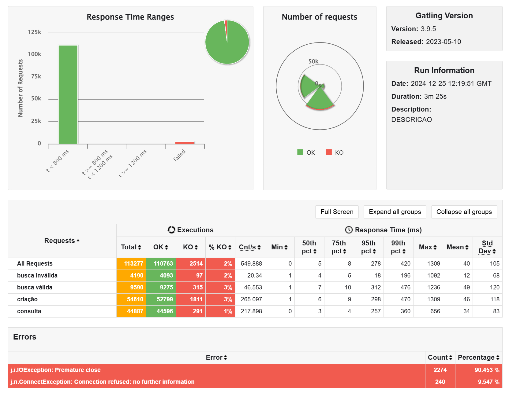

# Rinha Backend 2023

This project was developed while I was studying Rust, by following [@reu](https://github.com/reu)'s [stream](https://www.youtube.com/watch?v=aXQenZGvLrQ) and coding along with him. The project itself consists of an entry for the brazilian developer community challenge [rinha-de-backend-2023-q3](https://github.com/zanfranceschi/rinha-de-backend-2023-q3/tree/main?tab=readme-ov-file), by [@zanfranceschi](https://github.com/zanfranceschi). It basically consists of a simple API that runs with certain hardware constraints and undergoes a stress test using Gatling.

## Crates
This project uses the following Rust crates:
- `axum`- popular web application framework (alternative to `actix`);
- `serde` - for serialization and deserialization of data structures;
- `sqlx` - async SQL toolkit, which provides very useful macros that validate queries at compile time;
- `time` - popular datetime create (alternative to `chrono`);
- `tokio` - popular async runtime, also used internally by `axum` and `sqlx`;
- `uuid`.

## Running

The server uses Postgres for persistence. The `docker-compose-dev.yml` file can be used to create a Postgres container for standalone testing the application with `cargo run`.

To run the application for the stress test, the `docker-compose.yml` file should be used. Following the challenge [speficiations](https://github.com/zanfranceschi/rinha-de-backend-2023-q3/blob/main/INSTRUCOES.md), it launches two instances of the API, behind a NGINX server which acts as a load balancer. The containers may use up to a total of 1.5 CPUs and 3.0GB of memory. 

The Gatling battery of tests can be found [here](https://github.com/zanfranceschi/rinha-de-backend-2023-q3/tree/main/stress-test). After cloning/copying this folder, execute the file `geracao_recursos.py` to generate test data, then execute one of the `run-test` scripts.

## Results

According to the Gatling stress test report, the application performed reasonably well. ~45k people were created, which would enter the challenge's top 10. Some requests failed due to error `j.i.IOException: Premature close`. As mentioned in [@akitaonrails](https://github.com/akitaonrails)'s [video](https://www.youtube.com/watch?v=EifK2a_5K_U), this is caused by the slowdown introduced by Docker's internal DNS layer, which can be solved exclusively on Linux by using `network_mode: host`, but I was developing on Windows and didn't find a solution at the time.

